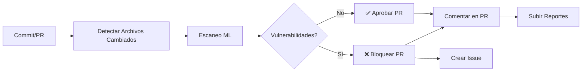

# Sistema de Detección de Vulnerabilidades con Machine Learning

**Pipeline CI/CD Seguro con Integración de IA para Detección Automática de Vulnerabilidades**

[](https://github.com)
[](https://python.org)
[](LICENSE)

Escáner de vulnerabilidades basado en Machine Learning para código Python y JavaScript con integración completa en CI/CD.

---

## 🚀 Inicio Rápido

### 1. Entrenar el Modelo
```bash
# Abrir y ejecutar el notebook de entrenamiento:
train_detector.ipynb

# O ejecutar desde línea de comandos:
python ml_model/model.py
```
Tiempo de entrenamiento: 30min a 1 hora utilizando 84,588 muestras reales CVE/CWE (Python + JavaScript)

### 2. Escanear Código Localmente
```bash
# Escanear un archivo individual
python scripts/vulnerability_scanner.py tests/vulnerable_code_example.py

# Escanear un directorio completo
python scripts/vulnerability_scanner.py src/

# Escanear solo archivos modificados (simulando CI/CD)
python scripts/get_changed_files.py --output changed.json
python scripts/vulnerability_scanner.py --files-list changed.json
```

### 3. Ver Reporte
```bash
# El reporte HTML se genera automáticamente
start reports/scan_results.html
```

---

## 🔄 Pipeline CI/CD Automático

### Configuración GitHub Actions

El sistema incluye un workflow completo que:

✅ **Se ejecuta automáticamente** en cada push y pull request  
✅ **Detecta archivos cambiados** y escanea solo lo modificado  
✅ **Analiza con IA** usando modelo Random Forest entrenado  
✅ **Genera reportes** HTML y JSON con explicabilidad  
✅ **Comenta en PRs** con resultados detallados  
✅ **Bloquea merge** si detecta vulnerabilidades críticas  
✅ **Crea issues** automáticos para vulnerabilidades en push  

### Flujo de Trabajo



### Activación del Pipeline

1. **Hacer commit de cambios**:
```bash
git add .
git commit -m "feat: nueva funcionalidad"
git push origin feature-branch
```

2. **El pipeline se ejecuta automáticamente** y:
   - Detecta archivos `.py` y `.js` modificados
   - Ejecuta análisis ML en cada archivo
   - Genera reporte de vulnerabilidades
   - Comenta resultados en la PR

3. **Revisar resultados**:
   - Ver comentario automático en la PR
   - Descargar reporte HTML desde Artifacts
   - Corregir vulnerabilidades si las hay
   - Re-push para validación

---

## 📋 Configuración del Pipeline

### Archivo: `config.yml`

```yaml
model:
  threshold: 0.70  # 70% umbral de vulnerabilidad

scanner:
  file_extensions:
    - ".py"
    - ".js"
  excluded_directories:
    - "__pycache__"
    - "node_modules"

cicd:
  fail_on_high_risk: true
  pr_comments: true
  issue_threshold:
    high_risk_count: 3  # Crear issue si >3 archivos de alto riesgo
```

### Variables de Entorno (GitHub Secrets)

```bash
# No requiere configuración adicional
# Usa GITHUB_TOKEN automático
```

---

## 📊 Capacidades de Detección

El sistema detecta los siguientes patrones de vulnerabilidades:

| Categoría | Descripción |
|-----------|-------------|
| 🔴 **Inyección de Código** | `eval()`, `exec()`, `__import__` |
| 🔴 **SQL Injection** | Concatenación en queries SQL |
| 🔴 **Command Injection** | `os.system()`, `subprocess` con `shell=True` |
| 🟡 **Criptografía Débil** | MD5, SHA1, DES, RC4 |
| 🟡 **Deserialización Insegura** | `pickle.load()`, YAML unsafe |
| 🟡 **Secretos Hardcodeados** | Passwords, API keys, tokens |
| 🟢 **Path Traversal** | Validación de rutas de archivos |
| 🟢 **Manejo de Excepciones** | `except:` sin tipo específico |

---

## 🏗️ Arquitectura del Modelo

**Algoritmo**: Random Forest Classifier

**Configuración**:
- 200 árboles de decisión
- Profundidad máxima: 15 niveles
- Pesos de clase balanceados
- Procesamiento multi-núcleo habilitado

**Características**: 27 características extraídas del código mediante AST

**Dataset**: 84,588 muestras reales de vulnerabilidades
- Python: 2,316 muestras CVE/CWE
- JavaScript: ~42,000 muestras CVE/CWE
- Balanceado: 50% vulnerable, 50% seguro

**Métricas de Rendimiento**:
- Precisión de entrenamiento: 100%
- ROC-AUC: 1.0000
- Validación cruzada: 94.56% ± 9.81%

---

## 📁 Estructura del Proyecto

```
.
├── .github/
│   └── workflows/
│       └── security-scan.yml        # Pipeline CI/CD completo
├── Dataset/
│   ├── data_Python.csv              # 2,316 muestras Python
│   └── data_JavaScript.csv          # ~42K muestras JavaScript
├── ml_model/
│   ├── model.py                     # Implementación Random Forest
│   └── vulnerability_detector.pkl   # Modelo entrenado
├── scripts/
│   ├── code_analyzer.py             # Extracción de características (27)
│   ├── vulnerability_scanner.py     # Motor de escaneo principal
│   ├── report_generator.py          # Generación de reportes HTML
│   └── get_changed_files.py         # 🆕 Detección de archivos cambiados
├── tests/
│   ├── vulnerable_code_example.py   # Casos de prueba vulnerable
│   ├── secure_code_example.py       # Casos de prueba seguro
│   ├── vulnerable_code_js.js
│   ├── secure_code_js.js
│   └── test_cicd_integration.py     # 🆕 Tests del pipeline
├── reports/                          # Reportes generados
├── config.yml                        # 🆕 Configuración del scanner
├── Dockerfile                        # 🆕 Contenerización
├── docker-compose.yml                # 🆕 Orquestación local
├── requirements.txt                  # Dependencias Python
└── train_detector.ipynb              # Notebook de entrenamiento
```

---
- 200 árboles de decisión
- Profundidad máxima: 15 niveles
- Pesos de clase balanceados
- Procesamiento multi-núcleo habilitado

**Características**: 27 características del código basadas en AST extraídas del código fuente

**Dataset**: 84,588 muestras reales de vulnerabilidades
- Python: 2,316 muestras de la base de datos CVE/CWE
- JavaScript: ~42,000 muestras de la base de datos CVE/CWE
- Dataset balanceado: 50% vulnerable, 50% seguro (utilizando código patch)

**Métricas de Rendimiento**:
- Precisión de entrenamiento: 100%
- ROC-AUC: 1.0000
- Validación cruzada: 94.56% ± 9.81%

---

## Estructura del Proyecto

```
train_detector.ipynb              Notebook de entrenamiento (5 celdas)
Dataset/
  ├── data_Python.csv             Vulnerabilidades Python (2,316 muestras)
  └── data_JavaScript.csv         Vulnerabilidades JavaScript (~42K muestras)
ml_model/
  ├── model.py                    Implementación Random Forest
  └── vulnerability_detector.pkl  Modelo entrenado
scripts/
  ├── code_analyzer.py            Extracción de características AST (27 características)
  ├── vulnerability_scanner.py    Motor principal de escaneo
  └── report_generator.py         Generación de reportes HTML
tests/
  ├── vulnerable_code_example.py  Casos de prueba Python
  ├── secure_code_example.py
  ├── vulnerable_code_js.js       Casos de prueba JavaScript
  └── secure_code_js.js
```

---

## 🐳 Uso con Docker

### Construcción de la Imagen

```bash
# Construir imagen
docker build -t vulnerability-scanner:latest .

# Verificar imagen
docker images | grep vulnerability-scanner
```

### Escaneo con Docker

```bash
# Escanear directorio actual
docker run --rm \
  -v "$(pwd):/code:ro" \
  -v "$(pwd)/reports:/app/reports:rw" \
  vulnerability-scanner:latest \
  --target /code --output /app/reports/scan_results.json

# Escanear archivo específico
docker run --rm \
  -v "$(pwd):/code:ro" \
  vulnerability-scanner:latest \
  --files /code/src/app.py
```

### Docker Compose

```bash
# Ejecutar escaneo completo
docker-compose run vulnerability-scanner

# Entrenar modelo (si es necesario)
docker-compose run model-trainer
```

---

## 🧪 Tests y Validación

### Ejecutar Tests Localmente

```bash
# Instalar dependencias de testing
pip install pytest pytest-cov

# Ejecutar todos los tests
pytest tests/ -v

# Con coverage
pytest tests/ --cov=scripts --cov=ml_model --cov-report=html

# Solo tests de integración CI/CD
pytest tests/test_cicd_integration.py -v
```

### Validar Pipeline Localmente

```bash
# 1. Simular detección de archivos cambiados
python scripts/get_changed_files.py --output changed_files.json

# 2. Ejecutar scanner en archivos cambiados
python scripts/vulnerability_scanner.py --files-list changed_files.json

# 3. Verificar reportes generados
ls -lh reports/
```

---

## 📖 Ejemplos de Uso

### Escanear un Archivo Individual

```bash
python scripts/vulnerability_scanner.py tests/vulnerable_code_example.py
```

**Salida**:
```
Escaneando 1 archivo(s) específico(s)
============================================================
   Python (.py): 1
   JavaScript (.js): 0

ALERTA [Python]: tests/vulnerable_code_example.py
   Probabilidad de vulnerabilidad: 99.50%
   Nivel de riesgo: CRÍTICO
   Factores de riesgo detectados:
      - Uso de eval()
      - Uso de exec()
      - Secretos hardcodeados
      - subprocess con shell=True
      - SQL injection (concatenación)

============================================================
Resumen del escaneo:
   Total de archivos analizados: 1
   Vulnerabilidades detectadas: 1
   Archivos de alto riesgo (>70%): 1

❌ Escaneo FALLÓ: 1 vulnerabilidades detectadas
```

### Escanear Directorio con Umbral Personalizado

```bash
python scripts/vulnerability_scanner.py src/ --threshold 0.80
```

### Escanear Solo Archivos Modificados

```bash
# Comparar con rama main
python scripts/get_changed_files.py --base origin/main --head HEAD --output changed.json

# Escanear solo los archivos cambiados
python scripts/vulnerability_scanner.py --files-list changed.json

# Ver reporte
open reports/scan_results.html
```

---

## 🔧 Configuración Avanzada

### Ajustar Umbrales de Riesgo

Editar [`config.yml`](config.yml):

```yaml
risk_levels:
  critical:
    min_probability: 0.90
  high:
    min_probability: 0.70
  medium:
    min_probability: 0.40
  low:
    min_probability: 0.0
```

### Excluir Directorios del Escaneo

```yaml
scanner:
  excluded_directories:
    - "__pycache__"
    - "node_modules"
    - "venv"
    - "build"
    - "dist"
    - "test_data"  # Agregar custom
```

### Personalizar Workflow CI/CD

Editar [`.github/workflows/security-scan.yml`](.github/workflows/security-scan.yml):

```yaml
env:
  RISK_THRESHOLD: '0.80'  # Aumentar umbral a 80%
  
on:
  push:
    branches: [ main, develop, staging ]  # Agregar más branches
```

---

## 📊 Interpretación de Resultados

### Niveles de Riesgo

| Nivel | Probabilidad | Color | Acción Recomendada |
|-------|-------------|-------|-------------------|
| 🔴 **CRÍTICO** | ≥ 90% | Rojo | Bloquear deploy, corregir inmediatamente |
| 🟠 **ALTO** | 70-89% | Naranja | Bloquear merge, revisar antes de aprobar |
| 🟡 **MEDIO** | 40-69% | Amarillo | Revisar y documentar, no bloquear |
| 🟢 **BAJO** | < 40% | Verde | Informativo, sin acción requerida |

### Factores de Riesgo Comunes

**Críticos (Corrección Inmediata)**:
- `eval()` / `exec()` - Inyección de código
- SQL concatenado - SQL Injection
- `shell=True` - Command Injection
- Secretos hardcodeados - Exposición de credenciales

**Importantes (Revisar Pronto)**:
- Criptografía débil (MD5, SHA1)
- Deserialización insegura (pickle)
- Path traversal sin validación
- Manejo genérico de excepciones

---

## 🔄 Proceso de Entrenamiento

El pipeline de entrenamiento consiste en 5 pasos:

1. **Cargar Datasets**: Combina datos CVE/CWE de Python y JavaScript
2. **Extraer Características**: Analiza código vulnerable y parches (seguro)
3. **Entrenar Modelo**: Ajusta Random Forest con 84,588 muestras
4. **Validar**: Validación cruzada con 5 folds
5. **Guardar Modelo**: Persiste en `ml_model/vulnerability_detector.pkl`

**Ejecutar entrenamiento**:
```bash
# Opción 1: Notebook (recomendado para exploración)
jupyter notebook train_detector.ipynb

# Opción 2: Script (para CI/CD)
python ml_model/model.py
```

**Re-entrenar con nuevos datos**:
1. Agregar nuevas muestras a `Dataset/data_Python.csv` o `data_JavaScript.csv`
2. Ejecutar el notebook o script
3. El nuevo modelo sobrescribirá `vulnerability_detector.pkl`
4. Commit del nuevo modelo al repositorio

---

## 🚨 Resolución de Problemas

### El modelo no se encuentra

```bash
Error: Modelo no encontrado en ml_model/vulnerability_detector.pkl
```

**Solución**:
```bash
# Entrenar el modelo
python ml_model/model.py

# O descargar desde releases si existe
# git lfs pull  # Si usas Git LFS
```

### El pipeline falla en GitHub Actions

**Problema**: Modelo no incluido en el repositorio

**Soluciones**:
1. Subir el modelo `.pkl` al repositorio (si es pequeño)
2. Usar Git LFS para archivos grandes
3. Entrenar automáticamente en CI (ver workflow):
```yaml
- name: Train Model if Missing
  run: |
    if [ ! -f "ml_model/vulnerability_detector.pkl" ]; then
      python ml_model/model.py
    fi
```

### Falsos positivos

Si el scanner marca código seguro como vulnerable:

1. **Revisar el código**: Podría tener patrones sospechosos
2. **Ajustar umbral**: Aumentar a 0.80 o 0.90
3. **Re-entrenar modelo**: Con más ejemplos del patrón específico
4. **Excluir archivo**: Agregar a `.gitignore` o config exclusions

---

## 📚 Recursos y Referencias

### Documentación

- [Configuración del Pipeline](config.yml)
- [GitHub Actions Workflow](.github/workflows/security-scan.yml)
- [Tests de Integración](tests/test_cicd_integration.py)

### Seguridad

- [OWASP Top 10](https://owasp.org/www-project-top-ten/)
- [CWE - Common Weakness Enumeration](https://cwe.mitre.org/)
- [Python Security](https://python.readthedocs.io/en/stable/library/security_warnings.html)
- [JavaScript Security](https://cheatsheetseries.owasp.org/cheatsheets/Nodejs_Security_Cheat_Sheet.html)

### Machine Learning

- [scikit-learn Random Forest](https://scikit-learn.org/stable/modules/ensemble.html#forest)
- [SHAP para Explicabilidad](https://shap.readthedocs.io/)

---

## 🤝 Contribución

### Agregar Nuevas Vulnerabilidades al Dataset

1. Editar `Dataset/data_Python.csv` o `data_JavaScript.csv`
2. Agregar filas con el formato: `codigo_vulnerable,1` o `codigo_seguro,0`
3. Re-entrenar modelo: `python ml_model/model.py`
4. Validar con tests: `pytest tests/`

### Extender Características de Análisis

Editar [`scripts/code_analyzer.py`](scripts/code_analyzer.py) para agregar nuevas características en la clase `CodeFeatures`.

---

## 📝 Licencia y Proyecto Académico

**Proyecto**: Laboratorio de Seguridad Informática y Modernización de Aplicaciones  
**Objetivo**: Pipeline CI/CD Seguro con Integración de IA para Detección Automática de Vulnerabilidades  
**Dataset**: Bases de datos reales CVE/CWE

---

## 📞 Soporte

Para problemas o preguntas:
1. Revisar la sección de [Resolución de Problemas](#-resolución-de-problemas)
2. Consultar los [tests de ejemplo](tests/)
3. Crear un issue en el repositorio

---

**🔒 Mantén tu código seguro con Machine Learning** 🤖
